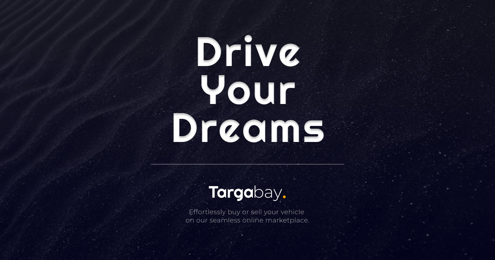

# Auto Marketplace Client

Welcome to the Auto Marketplace Client project! This platform is designed to provide users with a seamless and intuitive experience for buying and selling vehicles online.

 

## Features

1. **Free Vehicle Listings**

    - List your vehicle for free on our platform. Reach a wide audience of potential buyers without any cost.

2. **Advanced Search Filters**

    - Easily find the vehicle that suits your needs with advanced search filters. Filter by make, model, year, price range, and more.

3. **Subscription and Notifications**

    - Subscribe to specific criteria and receive notifications whenever new listings matching your interests are added. Stay informed without constantly checking the platform.

4. **Simple and Intuitive User Experience**
    - We prioritize a clean and user-friendly design to ensure a straightforward experience for both buyers and sellers. Navigate through the platform with ease.

## Tech Stack

This project leverages [Next.js](https://nextjs.org/) version 14, incorporating the latest enhancements such as the app router and server components. Next.js is a powerful React framework designed for web application development. The complete tech stack includes:

-   **Next.js**: A robust React framework with version 14 features, including an advanced app router for intuitive navigation and server components for optimized server-side rendering.
-   **Vercel**: The web app is deployed on the edge network using Vercel, ensuring fast and reliable hosting with global reach.
-   **Tailwind CSS**: A utility-first CSS framework for crafting modern designs efficiently.
-   **DaisyUI**: Tailwind CSS extensions that streamline development and enhance styling capabilities.
-   **Auth0**: A flexible authentication and authorization platform.
-   **AWS S3**: A secure and scalable object storage service for efficient data storage and retrieval.
-   **ImageKit**: Real-time image optimization and transformation service.
-   **TypeScript**: A typed superset of JavaScript, improving code quality and maintainability.
-   **Zod**: TypeScript-first schema declaration and validation library.
-   **Storybook**: A development environment for UI components, allowing for isolated and interactive component development.
-   **Playwright**: A Node.js library for automating browsers, enabling end-to-end testing and browser automation.

## Getting Started

**Note:**
This repository contains the client-side code for the Auto Marketplace project. However, the backend code is currently private and not included in this repository. As a result, you won't be able to run the project locally without the backend.

If you are interested in exploring the client-side code or contributing to the project, feel free to do so. Keep in mind that a fully functional local setup requires the backend, which is not publicly available at the moment.

## Prerequisites

To run the project locally, you need to have the backend set up separately. For access to the backend code and further details, please contact the project maintainers.

## Contributing

We welcome contributions! If you'd like to contribute to the client-side code or have questions about the project, please follow our [contribution guidelines](.github/CONTRIBUTING.md).

## License

This project is licensed under the [MIT License](LICENSE).

## Contact

If you have any questions or feedback, feel free to reach out to us at [a.kajendran@gmail.com](mailto:a.kajendran@gmail.com).
